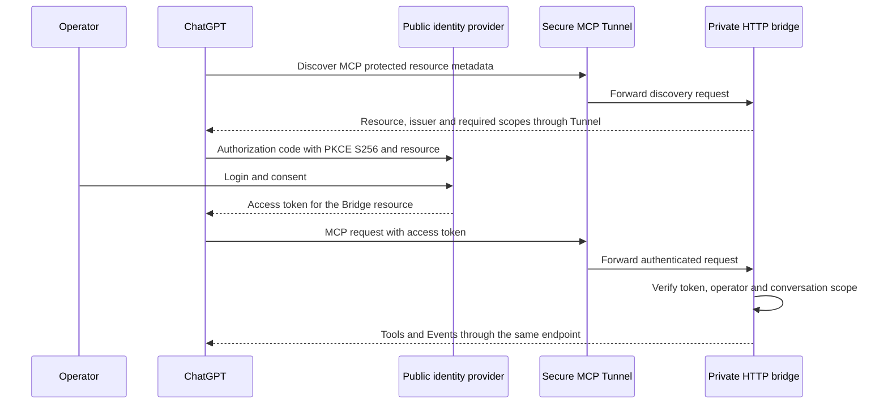

# Authenticated ChatGPT / Tunnel connection for MCP Events

## Decision and current status

The product connection selected for [issue #213](https://github.com/menaje/codex-mcp-bridge-for-chatgpt/issues/213)
is **user OAuth 2.1 through a private HTTP Secure MCP Tunnel**. An established
identity provider issues access tokens; the bridge verifies them and binds a
stable operator principal to Jobs, subscriptions and approved followups.

The bridge now implements an opt-in HTTP access-JWT adapter and authenticated
Tunnel launcher path, with isolated synthetic acceptance. On 2026-10-01, the
operator approved a temporary HTTPS authorization-only edge and a dedicated
test Tunnel/ChatGPT connector. Actual ChatGPT OAuth discovery and connector
creation succeeded through the product launcher after correcting its private
metadata source. The composed OpenAI/Bridge OAuth connection subsequently
completed in the **Codex In-app Browser** after correcting consent Origin and
form-redirect policies. ChatGPT shows the connected account, and its real code
exchange returned HTTP 200. The app discovers `codex.job.terminal`, and an
authenticated project query succeeded. Safari and a Mac unlock were not needed
for this successful retry. One read-only A turn was admitted, but its result
reported an unavailable command runner rather than fixture JSON. The actual
existing chat and a fresh capability-only test chat reported no callable native
Events subscription facility even after plugin rescan; no subscription or B
was created. This observation does not establish the cause or global host
support. These limits still prevent #213 acceptance.
The [live discovery audit](audits/2026-10-01-issue-213-tunnel-oauth-discovery.md)
records the first failure/fix; the [consent audit](audits/2026-10-01-issue-213-oauth-consent.md)
records the first browser regression; the [In-app audit](audits/2026-10-01-issue-213-inapp-oauth.md)
records the successful composed grant and remaining execution/host boundaries. An opt-in
[local OpenAI/Bridge authorization prototype](mcp-events-openai-authorization.md)
now implements the separate token issuer with isolated HTTP integration tests.
No permanent public HTTPS hosting has been selected. Issue #213 stays open. The default
launcher still uses No Auth, and Events on that connection are denied. Existing
static-bearer tests and the new JWT/JWKS fixture tests are bridge evidence,
not evidence of a real ChatGPT login or conversation resume.

OpenAI documents OAuth 2.1 authorization-code with PKCE `S256` for authenticated
MCP connections. ChatGPT cannot present a customer-defined API key. Adding the
installation bearer to a Tunnel profile therefore does not establish the
documented product connection. See [OpenAI authentication](https://developers.openai.com/plugins/build/auth).

The [Secure MCP Tunnel guide](https://developers.openai.com/api/docs/guides/secure-mcp-tunnels)
supports OAuth discovery through the tunnel while the MCP server stays private.
The authorization server is not automatically tunneled: its discovery, browser
login and token endpoints must be reachable from the public internet and the
tunnel-client host. This design uses the private developer-mode connection;
public plugin distribution has a separate public-HTTPS endpoint requirement.

The operator does not need to publish the bridge, Codex, local project files or
a login server they operate themselves. A managed identity provider can host
the HTTPS login and token service; for example,
[Auth0 Universal Login](https://auth0.com/docs/authenticate/login/auth0-universal-login)
hosts its login pages on the provider's authorization server. Self-hosting an
identity provider would instead require operating that public HTTPS service.
The approved trial uses a temporary Cloudflare Quick Tunnel for only the
separate local authorization service; it is not a permanent hosting decision.

The [Auth0 setup runbook](mcp-events-auth0.md) provides a concrete managed
provider candidate, including resource compatibility, operator permissions,
client registration choices and the tenant-plan limitation on CIMD private-key
authentication. It is a configuration plan, not a provisioned account or proof
of ChatGPT interoperability. Provider choice remains an operator decision.

### OpenAI sign-in trial

At the operator's request, isolated OpenAI sign-in trials were run on
2026-10-01. The [official cookbook](https://developers.openai.com/cookbook/articles/sign-in-with-chatgpt)
distinguishes public open-source/local-project **ChatGPT plan usage** from
**identity-only integration**, which is currently offered to selected commercial
partners. The public open-source example requests `openid profile email
offline_access resource.invoke chatgpt.tokens.use.direct`. The earlier
profile-only trial requested just the first three scopes and returned
`invalid_state` in the In-app Browser and Safari. Those failures do not establish
that the complete public open-source registration flow is unavailable. Their
precise cause remains unconfirmed; reaching a sign-in screen was not success.

After the operator explicitly approved the additional plan-use, API-access and
refresh scopes, the [open-source flow](https://developers.openai.com/siwc/token-sharing-open-source/sign-in)
was tested in Safari with all six documented scopes. At 2026-10-01 05:32:10 UTC
(14:32:10 KST), the loopback callback completed, OpenAI issued a client ID and
authorization-code exchange succeeded. The probe verified the ID token's RS256
signature against the advertised JWKS, exact issuer and issued-client audience,
expiry, nonce and applicable `azp` checks. All six requested scopes were granted,
with an access token and refresh token. No model/API inference or refresh
request was made, and raw authorization codes or tokens were not retained by
the probe. This establishes isolated registration and verified sign-in, not
working model access, installed-product acceptance or MCP Events authentication.

The probe used a stable system-issued host ID, fresh state/nonce/PKCE `S256`,
a loopback-only listener and the issued client ID for code exchange. A nonsecret
registration ID and verified-identity hash were retained privately for retries;
profile values, raw subject and credentials were not written to repository or
trial reports. The listener exited after verification. The safe local report
records `identity_verified`, successful signature/audience/nonce checks,
`planPermissionGranted: true`, `modelRequests: 0` and
`mcpEventsVerified: false`. No partner application was submitted, and the
installed app, operational database, Tunnel and existing Codex credentials
were not changed.

An OpenAI ID token identifies a user to its issued client. OpenAI plan-use tokens
target the OpenAI API. Neither supplies the current Bridge's resource audience
and `bridge` grant. The [local authorization prototype](mcp-events-openai-authorization.md)
implements that separate grant boundary, but using it for actual Events still
needs public HTTPS hosting and composed ChatGPT acceptance. The [native plugin integration](https://developers.openai.com/siwc/chatgpt-plugin)
has a separate selected-partner registration contract; that restriction must
not be generalized to the successful public open-source trial. Account hints,
copied Codex credentials and the OpenAI API audience cannot replace the Bridge
authorization boundary.

This OAuth route introduces an external authentication dependency beyond the
existing local bridge and outbound Tunnel. It remains optional: the current
No Auth connection and local execution continue without provider configuration.
Events on that connection remain unavailable under the current authenticated
ownership contract. Provider selection must not be treated as permission to
deploy a service or change the installed app's connection.

## Roles and credentials



This is the product flow to validate after provider configuration. Tunnel workspace association
and its control-plane runtime key authorize the transport. They are separate
from the user's OAuth token and do not supply a verified end-user principal to
the bridge. Callback challenge verification establishes callback control, not
user identity. `openai/session`, `openai/subject` and organization metadata
remain correlation values. A published OpenAI client certificate or OAuth
client registration identifies the client application, not the operator.

The bridge remains a service for one trusted operator. It must accept only the
configured verified issuer/subject pair, along with the resource audience and
required Bridge scope. This work does not introduce multi-user project sharing.
The Codex login used to execute a Job is a separate credential. [Issue #214](https://github.com/menaje/codex-mcp-bridge-for-chatgpt/issues/214)
concerns execution-provider subscription authentication, not the MCP subscriber
identity, and is not a prerequisite for this OAuth connection.

## Configuration required before actual host acceptance

No Bridge-specific issuer, client or access grant has been provisioned. The table identifies
the external configuration and evidence needed before the installed-product
trial. The current adapter supports access JWTs, not opaque-token introspection.

| Input | Required configuration and evidence |
| --- | --- |
| Identity provider | An established provider with public HTTPS OAuth/OIDC discovery, authorization-code flow, advertised PKCE `S256`, and authorization/token endpoints reachable by the required clients. Select by these capabilities; no vendor or account is chosen yet. |
| Exact issuer | One canonical issuer string, identical in provider discovery and the bridge's `authorization_servers` metadata. Preserve paths, case and trailing slashes exactly. |
| MCP resource / audience | One canonical HTTPS resource identifier, echoed in authorization and token requests and bound into the access token audience. Capture the actual ChatGPT/Tunnel discovery and challenge URLs before configuring it; do not guess a Tunnel URL or use the local HTTP forwarding address. |
| Operator and permission | The provider's verified stable subject for the permitted operator and an enabled Bridge API scope. The initial adapter requires the existing `bridge` permission. An email, OAuth client ID or caller-supplied subject is insufficient. |
| Client registration | Prefer Client ID Metadata Documents (CIMD) when supported. DCR or a predefined OAuth client are also documented paths. Record the selected method and token-endpoint authentication method. |
| Redirect and client metadata | Copy the exact redirect URI and, for CIMD, client metadata URL shown on the actual ChatGPT connection management page. Stable redirects depend on provider support for RFC 9207 issuer identification; do not construct or guess them. |
| Token validation | Configure the provider to issue access JWTs signed with RS256, PS256, ES256 or EdDSA and publish a trusted HTTPS JWKS endpoint. Opaque tokens/introspection are not implemented. Tokens need the exact resource audience, stable subject, expiry and a space-delimited `scope` containing `bridge`. OIDC ID tokens are not Bridge access tokens. |
| Renewal and revocation | Define token lifetime, refresh/reauthorization, operator revocation and a finite subscription grant policy. JWT validation by itself cannot prove immediate remote revocation. Advertised OIDC scopes must also be enabled for the chosen client. |
| Tunnel | Use a dedicated authenticated HTTP profile and the intended ChatGPT workspace association. Keep the control-plane runtime key separate from OAuth credentials. Verify metadata discovery through the actual connection. |
| Local sealing key | Keep a stable installation-owned secret outside SQLite for callback URL/signing-secret encryption. OAuth access tokens rotate and must not become the database encryption key. |

For CIMD, OpenAI documents `none` and `private_key_jwt` as supported token
endpoint client authentication methods. The latter is client identification
during authorization-code exchange; it is not permission to replace user login
with a machine-to-machine JWT bearer grant. OpenAI does not support that grant,
client credentials, service accounts or customer-defined API keys for this path.
These requirements come from [OpenAI's authentication contract](https://developers.openai.com/plugins/build/auth).

## Configure the opt-in adapter

Put these values in the private runtime environment file outside registered
projects. Use exact values from the selected provider and actual ChatGPT/Tunnel
connection; the following names are supported, but the placeholders are not a
working configuration:

```dotenv
CODEX_MCP_BRIDGE_NO_AUTH=0
CODEX_MCP_BRIDGE_OAUTH_ISSUER=<exact-provider-issuer>
CODEX_MCP_BRIDGE_OAUTH_RESOURCE=<canonical-https-mcp-resource>
CODEX_MCP_BRIDGE_OAUTH_RESOURCE_METADATA_URL=http://127.0.0.1:8876/.well-known/oauth-protected-resource/mcp
CODEX_MCP_BRIDGE_OAUTH_JWKS_URI=<provider-https-jwks-uri>
CODEX_MCP_BRIDGE_OAUTH_OPERATOR_SUBJECT=<verified-provider-subject>
CODEX_MCP_BRIDGE_EVENTS_ENABLED=1
CODEX_MCP_BRIDGE_TOKEN=<stable-installation-secret-of-at-least-32-bytes>
```

Do not normalize the issuer or subject. The issuer, resource and JWKS must use
HTTPS without credentials, query, fragment or unescaped whitespace. Only the
protected-resource metadata URL may use HTTP: it must match the Bridge's exact
loopback binding and port and one of the two metadata paths below. The example
uses the HTTP launcher's default port; change it together with `--port`.
Public HTTPS metadata remains supported. Obtain the subject through the
provider's authenticated operator account, not ChatGPT request metadata.
`CODEX_MCP_BRIDGE_TOKEN` is the stable callback-encryption secret in OAuth mode;
submitting it to `/mcp` does not authenticate. Retain it separately for backups,
and never replace it with a rotating OAuth access token.

With the provider ready, start the Node server using `npm run bridge:secure`
with HTTP transport and this private configuration. The launcher selects a
separate default `codex-mcp-bridge-oauth` profile and the OAuth-discovery sample
`sample_mcp_with_dcr`; the sample name does not choose the provider's client
registration method. Its managed identity includes an authentication digest,
and OAuth mode does not ignore discovery failures as No Auth. An explicit
OAuth/No Auth combination or OAuth/stdio request fails before execution starts.
The native app has no new provider-configuration form in this change.

The bridge serves metadata at both
`/.well-known/oauth-protected-resource` and
`/.well-known/oauth-protected-resource/mcp`, retaining Host/Origin checks.
For a private HTTP Tunnel, advertise this same-origin loopback metadata source
in the Bearer challenge. The launcher then enables
`--harpoon.allow-plaintext-http=true` for this validated configuration only.
With tunnel-client 0.0.14, private metadata is discovered and classified for
Harpoon routing; off-origin public metadata alone does not register a private
OAuth metadata target. A healthy tunnel or successful doctor probe therefore
does not establish ChatGPT OAuth discovery. Verify the actual connection UI.
Do not forward Harpoon's internal control MCP requests to the Bridge or weaken
private-host registration restrictions. See the official
[Tunnel connectors](https://github.com/openai/tunnel-client/blob/v0.0.14/docs/connectors.md)
and [configuration](https://github.com/openai/tunnel-client/blob/v0.0.14/docs/configuration.md).

Copy the resource identifier that ChatGPT actually displays after discovery;
it may be the canonical Tunnel endpoint. Configure that exact value as the
provider audience and Bridge resource, rather than substituting the local
source URL or inventing a public resource path. The authorization service
remains separately reachable over public HTTPS. Only `server/discover` and `tools/list` are public
without a token. Each tool advertises OAuth `securitySchemes` at the HTTP
descriptor and in `_meta`; unauthenticated tool calls return linking metadata
without running a handler. Other protected requests return a `401` Bearer
challenge. A token must be verified before result, card or Events access.

If a required JWKS lookup fails, verification remains unavailable: HTTP returns
`503`, `Retry-After: 5` and `{ "error": "authentication_unavailable", "retryable": true }`.
It does not emit an `invalid_token` challenge or account-linking metadata.
Fresh cached keys can still verify requests locally. A retry after provider
recovery can verify the same token; no re-login, new Job or receipt is inferred.
An invalid signature/claim, expired token or unknown key in a usable JWKS still
uses the existing authentication-error/linking path. Fetch/parser diagnostics
and token bytes are never included in the response.

## Bridge implementation boundaries

The implementation applies these bounded changes to the existing architecture:

1. An explicit HTTP OAuth mode in configuration and `src/server.ts` serves
   protected resource metadata and a proper `401` Bearer challenge carrying
   `resource_metadata`. Each access token is verified before protected MCP
   dispatch, rejecting
   missing, invalid, expired, wrong-issuer, wrong-audience, missing-scope and
   non-operator tokens. `jose` verifies asymmetric signatures against the
   configured HTTPS JWKS, with a five-second fetch timeout, 128 KiB response
   limit, no redirects and bounded cache/rotation refresh. Token headers cannot
   select key URLs. MCP dispatch does not create an authorization server; the
   opt-in OpenAI prototype is a separate command with its own private listeners
   and configuration.
2. A dedicated verified principal passes from middleware into
   `authenticatedMcpPrincipal()` and the existing task/scope checks. Derive it
   from the configured resource and verified issuer/subject, using an unambiguous
   stable encoding. It is independent of token bytes, expiry, JWT ID and OAuth
   `client_id`. SDK `AuthInfo.extra` carries the bridge-verified principal;
   `clientId` remains client-application information.
3. `McpEventsController` authorizes the configured operator principal
   independently of the current installation-bearer hash. Separate
   `EventDestinationVault` key ownership from short-lived access tokens.
   Preserve exact Job/scope/Activity/Agent checks, callback verification, the
   terminal-result transaction, receipt identity and retry/retention behavior.
4. Subscriptions are capped at verified access-token expiry, even when the
   requested/default TTL is longer. Expiry is checked again after the callback
   challenge. Renewal by the same verified user preserves the logical
   subscription and followup identities. Expiry or revocation stops delivery without cancelling Codex,
   rerunning a Job or releasing the retained result early.
   Delivery re-reads each exact grant before sending and after the response;
   revision-checked journal writes prevent an older delivery snapshot from
   undoing a renewal or unsubscribe. Renewal preserves delivery progress
   committed while its callback challenge was awaiting a response.
5. The opt-in HTTP launcher/profile path preserves OAuth configuration and
   never downgrades to No Auth. OAuth settings and the installation sealing
   secret are stripped from Codex and Tunnel child environments; only the
   bridge process receives them. Authentication changes invalidate profile
   reuse. Explicit OAuth plus stdio fails clearly.
6. Isolated tests exercise the real HTTP MCP handler, current SDK client,
   fixture JWT signing/JWKS HTTP server and temporary state. They cover invalid
   tokens, foreign users, token renewal, discovery/challenges, grant expiry, restart,
   callback access and concurrent repeated B admissions. Synthetic provider
   tests do not implement browser login or replace actual ChatGPT acceptance.

Revocation is bounded by token expiry and the configured operator. An operator
change revokes old deliveries at the bridge boundary. Provider-side immediate
revocation is not promised with offline JWT validation; use an appropriate
provider token lifetime and reauthorization policy. Changing the local sealing
secret without retaining the original key makes old encrypted destinations
unreadable and is not a token-refresh operation.

The adapter does not rewrite existing Job principals or approval receipts when
switching authentication modes. A new OAuth-authenticated A is required for the
first trial. Retained No Auth or static-bearer Jobs cannot gain OAuth ownership
just because the same local operator enables the new mode. Any later migration
needs its own explicit ownership and sealing-key recovery design.

The system-issued `followupId` and canonical `requestId` contract from `7090cf1`
stays in place. Neither a login nor an event creates approval for B, and no
separate workflow or review engine is needed.

## Actual acceptance sequence

Use an isolated bridge/database and a harmless fixture project after configuring
the provider. Record transport, authentication and host behavior separately.
The sequence follows [connect and test](https://developers.openai.com/plugins/deploy/connect-chatgpt)
and the [MCP Events contract](https://developers.openai.com/plugins/build/mcp-events).

1. Capture protected resource metadata as seen through Tunnel, provider
   discovery, exact resource/audience, client registration and redirect. A
   healthy Tunnel or successful metadata doctor check alone does not prove
   user authentication.
2. Complete operator login in ChatGPT. Prove that the bridge accepts the valid
   token and rejects missing/wrong-user tokens. Capture only redacted outcomes
   and principal references, never tokens or login secrets.
3. Admit A with an exact pre-approved B prompt through the authenticated
   connection. Discover/list/subscribe to its terminal event on the same
   authenticated endpoint, with the original conversation scope. Observe the
   callback challenge and committed subscription before waiting for A.
4. Record terminal commit and callback receipt separately. In the actual
   resumed conversation, GPT retrieves A's exact result and current version,
   reviews it, and requests B using the bridge-issued followup reference.
   Confirm one admitted B and one upstream execution when two GPT invocations
   or repeated events request that same reference.
5. Include an A with no approved B, foreign-scope reuse and changed-prompt
   controls. Token renewal and bridge restart must preserve the verified
   principal and references. Expiration/revocation must block delivery according
   to the documented grant policy without creating new work.
6. Test card closure, conversation switching, backgrounding and connectivity
   loss separately. Record the actual Chat model, Pro/usage behavior and
   limitations; webhook `2xx` is not evidence of preserved mode or GPT review.

The official connection design, JWT adapter and synthetic acceptance are complete.
The separate OpenAI/Bridge issuer and composed ChatGPT grant succeeded in the
approved temporary trial. Actual Events subscription/resume and successful
A-review → one B acceptance remain pending, as does permanent hosting. The
[design investigation](audits/2026-10-01-issue-213-auth-connection.md) and
[implementation audit](audits/2026-10-01-issue-213-oauth-http.md) separate
source/synthetic evidence from installed-product acceptance.
The [delivery and JWKS regression audit](audits/2026-10-01-issue-213-delivery-races.md)
records the subsequent race/error-classification corrections.
ChatGPT subsequently judged those two corrections acceptable through static
review at the user's request. This assessment did not independently rerun tests
or complete issue #213; final human acceptance requires separate evidence.


### Exact loopback metadata spelling

The HTTP metadata exception accepts only the configured canonical loopback host (`127.0.0.1`, `localhost`, or `[::1]`), exact numeric port, and either of the two documented well-known paths. Port 80 may be explicit or omitted. Compare the original string before URL normalization: empty credential/query/fragment markers, control characters, shortened or numeric IPv4 aliases, and dot-segment paths are rejected. Ordinary issuer, resource, JWKS and public metadata URLs still require HTTPS and reject raw control characters and empty markers before producing a response header. This does not enable plaintext authorization or JWKS requests.

The metadata URL is included in an HTTP authentication challenge and must be an ASCII URI. Use an ASCII (IDNA) hostname and percent-encode non-ASCII path characters. The configured string is preserved exactly; the Bridge rejects unsupported literal characters before serving responses rather than silently changing URL identity.
